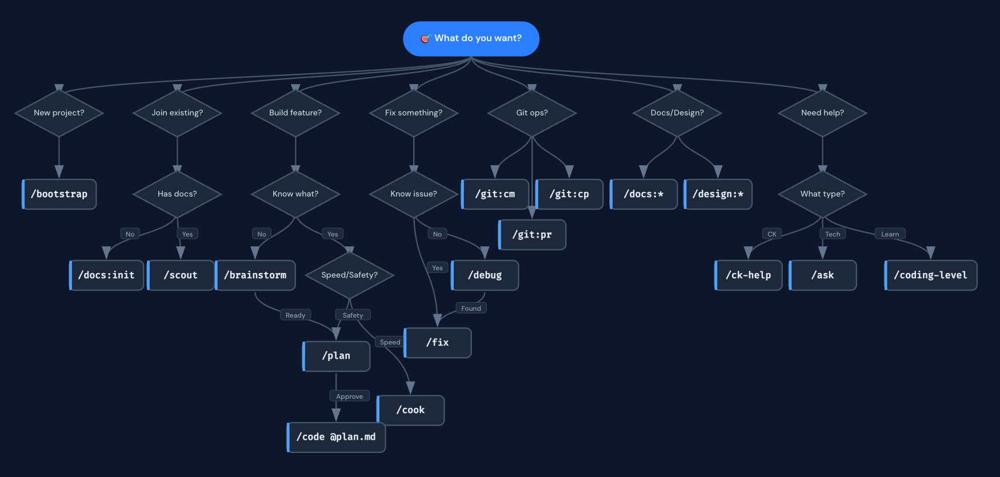
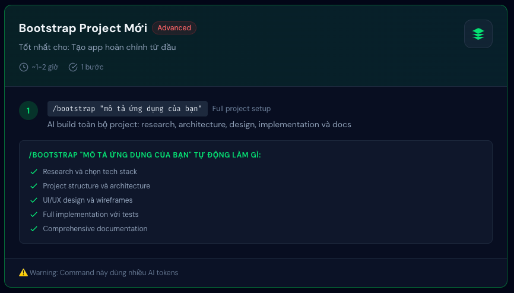
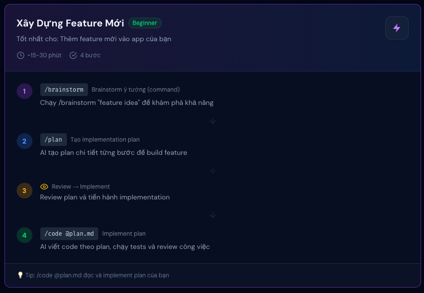
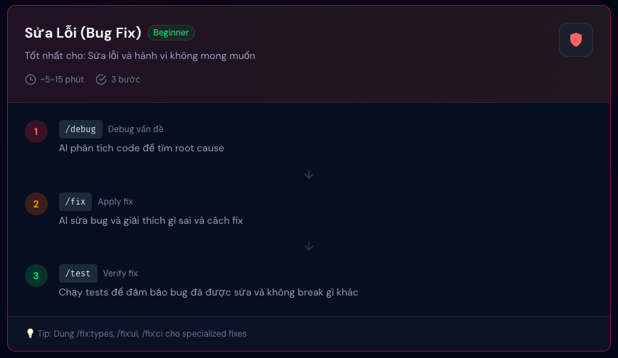
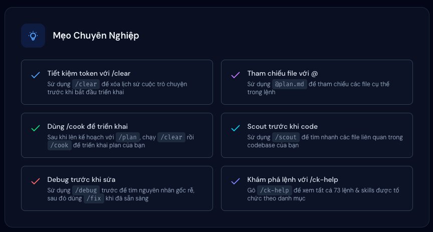

# 🚀 AI-Powered Development Workshop
**Antigravity Workflow Skills cho Dev Team**

---

## Lộ trình Workshop 3 tiếng

1. Tổng quan & Mindset (15')
2. UC1: Bootstrap Project (`/bootstrap`) (30')
3. UC2: Tham gia dự án có sẵn (`/docs:init`) (20')
4. UC3: Code Feature mới (`/brainstorm` → `/plan` → `/code`) (45')
5. UC4: Sửa Bug (`/debug` → `/fix`) (20')
6. UC5: Chuẩn hoá Team (`/docs:update`) (10')
7. Thực hành & Hỏi đáp (40')

---

## Khảo sát nhỏ
**(Một ngày làm việc của Dev)**

- Code boilerplate & setup: XX%
- Debug & tìm lỗi: XX%
- Đọc hiểu code cũ: XX%
- Viết documents/tests: XX%
- Code logic/feature mới: XX%

👉 **Mục tiêu:** Đảo ngược tỷ lệ → Tập trung tối đa vào "Code feature mới"

---

## AI Copilot vs AI Agent

| Tiêu chí | AI Copilot (Github Copilot) | AI Agent (Antigravity Workflow) |
| :--- | :--- | :--- |
| Cách hoạt động | Phản hồi (Reactive) | Chủ động (Proactive) |
| Phạm vi hiểu | Từng dòng lệnh (Line-by-line) | Toàn bộ dự án (Project-wide) |
| Context | Không có / Ít | Đọc rules, docs, standards |
| Khả năng | Gợi ý code | Lên kế hoạch → Code → Test |
| Tuân thủ | Phụ thuộc vào prompt | Tuân thủ tuyệt đối Team Rules |

---

## Kiến trúc 3 tầng - Antigravity

**RULES (Luôn hoạt động)**
Hướng dẫn, Coding Standards, Protocol

**WORKFLOWS (Dev gọi)**
`/bootstrap`, `/plan`, `/code`, `/fix`...

**SKILLS (Agent tự gọi)**
`testing`, `debugging`, `code-review`...

> **Khắc cốt ghi tâm:**
> * Rules: Định hình tư duy của Agent
> * Workflows: Quy trình làm việc của Bạn
> * Skills: Công cụ chuyên môn của Agent

---

## Decision Tree (Flowchart)

---

**"What do you want?" → 7 nhánh chính**
Highlight 5 UC sẽ học hôm nay:
1. New project? → `/bootstrap`
2. Join existing? → `/docs:init`
3. Build feature? → `/brainstorm` → `/plan` → `/code`
4. Fix something? → `/debug` → `/fix`
5. Team standards → `/docs:update`

---

---

---

---

---

## Nguyên tắc vàng

Agent follow 3 nguyên tắc:

🎯 **YAGNI** — Chỉ code cái cần thiết
💋 **KISS** — Giữ đơn giản
🔄 **DRY** — Không lặp code

→ Agent không over-engineer
→ Agent hỏi clarify trước khi làm
→ Output chất lượng phụ thuộc vào input của BẠN

---

## UC1: New Project

**Use Case 1: "Tôi muốn tạo project mới"**
`/bootstrap "Flutter todo app with Firebase"`

Agent sẽ:
1. Hỏi clarify requirements
2. Research tech stack
3. Tạo implementation plan
4. Setup project structure
5. Implement code
6. Viết tests
7. Review code
8. Tạo docs
9. Hướng dẫn onboarding

🎬 **LIVE DEMO**

---

## UC1: Bootstrap Flow

`/bootstrap`
 ├─ 1. Clarify requirements (hỏi ngược)
 ├─ 2. Research tech stack
 ├─ 3. Planning (tạo `plan.md`)
 ├─ 4. Wireframe (optional)
 ├─ 5. Implementation
 ├─ 6. Testing
 ├─ 7. Code review
 ├─ 8. Documentation (auto-generate `docs/`)
 └─ 9. Onboarding (setup env, API keys)

⏱️ Demo: tạo Flutter todo app từ đầu

---

## UC2: Join Existing

**Use Case 2: "Tôi vừa join project, không biết gì"**

**Bước 1:** `/docs:init`
→ Agent scan toàn bộ codebase & Auto-generate docs:
  • `project-overview-pdr.md`
  • `codebase-summary.md`
  • `code-standards.md`
  • `system-architecture.md`

**Bước 2:** `/scout "Find authentication logic"`
→ Agent tìm files liên quan

🎬 **LIVE DEMO**

---

## Use Case 3: Code Feature Mới

**Quy trình chuẩn: Ý tưởng → Kế hoạch → Thực thi**

1. **Bước 1:** `/brainstorm` (Tìm hướng giải quyết) → Kết quả: Báo cáo phân tích
2. **Bước 2:** `/plan` (Lập kế hoạch chi tiết) → Kết quả: Thư mục kế hoạch (phases)
3. **Bước 3:** `/code @plan.md` (Thực thi code) → Kết quả: Code chạy được + Tests

🎬 **Demo:** "Thêm màn hình Profile với tính năng upload Avatar"

---

## UC3: Brainstorm

`/brainstorm "Thêm Profile screen với avatar upload"`

Agent sẽ:
1. Discovery — hỏi clarify
2. Research — tìm best practices
3. Analysis — so sánh approaches
4. Debate — challenge ý tưởng
5. Consensus — đồng thuận giải pháp
6. Document — viết brainstorm report

Output: `plans/reports/brainstormer-*.md`
→ Agent KHÔNG code, chỉ tư vấn
🎬 **LIVE DEMO**

---

## UC3: Plan

`/plan "Implement profile screen based on brainstorm"`

Agent sẽ:
1. Analyze task complexity
2. Research (nếu complex)
3. Scout codebase
4. Tạo plan structure:
   `plans/260226-1409-profile-screen/`
   ├── `research/researcher-01-*.md`
   ├── `plan.md` (overview ≤80 dòng)
   └── `phase-01-*.md` (detail từng phase)

→ Agent KHÔNG code, chỉ lập kế hoạch
🎬 **LIVE DEMO**

---

## UC3: Code

`/code @plan.md`

Agent sẽ (6 bước):
1. Plan Detection — tìm plan, chọn phase
2. Analysis — đọc plan, map dependencies
3. Implementation — code theo plan
4. Testing — viết test, chạy test
5. Code Review — review code quality
6. User Approval — hỏi approve trước commit

→ Agent follow plan, KHÔNG code lung tung
→ Fail test = fix + re-test (không bỏ qua)
🎬 **LIVE DEMO**

---

## UC4: Fix Something (Overview)

**Use Case 4: "App bị lỗi, cần sửa"**

**Know issue?**
* **YES** → `/fix "mô tả bug"` (fix trực tiếp)
* **NO** → `/debug "mô tả triệu chứng"` (điều tra trước) → Found → `/fix`

---

## UC4: Debug

`/debug "Avatar không hiển thị trên Android"`

Agent sẽ:
1. Reproduce — cố tái hiện lỗi
2. Investigate — trace stack, check git diff
3. Analyze — tìm root cause
4. Report — viết debug report:
   • Root cause + evidence
   • Affected files
   • Recommended fix

Output: `plans/reports/debugger-*.md`
→ Agent KHÔNG fix, chỉ điều tra
🎬 **LIVE DEMO**

---

## UC4: Fix

`/fix "Avatar không hiển thị do sai image path"`

Agent routing thông minh (8 loại):
A) Type errors → focus type checking
B) UI/UX issues → focus design
C) CI/CD issues → analyze pipeline
D) Test failures → run + fix tests
E) Log analysis → trace errors
F) Multiple issues → parallel fix
G) Complex issues → research → plan → fix
H) Simple/Quick → direct fix

→ Auto-detect loại issue, chọn strategy phù hợp
🎬 **LIVE DEMO**

---

## UC5: Team Standards

**Use Case 5: "Chuẩn hóa quy trình team"**

`/docs:update` — Cập nhật docs theo code changes
• Scan codebase mới
• Diff với docs hiện tại
• Update từng file docs
• Validate references

**Quy trình team chuẩn:**
`[ Plan ]` → `[ Code ]` → `[ Test ]` → `[ Review ]` → `Merge`

---

## Rules: Sức Mạnh Thầm Lặng

**Rules = Quy tắc luôn active cho agent**

📁 `.agent/rules/`
├── `project-instructions.md` (hành vi chung)
├── `development-rules.md` (coding standards)
├── `orchestration-protocol.md` (cách agent delegate)
└── `documentation-management.md` (cách quản lý docs)

**Tại sao quan trọng?**
→ Mọi người dùng cùng rules = output nhất quán
→ Agent biết coding standards của team

---

## Coding Level

`/coding-level` → Set trình độ cho agent

* **Level 0: ELI5** — giải thích như cho trẻ 5 tuổi
* **Level 1: Junior** — giải thích kỹ, có ví dụ
* **Level 2: Mid** — balance giữa detail và speed
* **Level 3: Senior** — tối giản, focus output
* **Level 4: Lead** — high-level, architecture focus
* **Level 5: God mode** — code only, không giải thích

→ Team thống nhất level 2-3 cho daily work

---

## Hands-on Time!

⏱️ **45 phút thực hành**

* **Bài tập 1 (15'): Setup & Explore**
  → `/coding-level`, `/scout`, `/ask`
* **Bài tập 2 (20'): Build Feature**
  → `/brainstorm` → `/plan` → `/code`
* **Bài tập 3 (10'): Fix Bug**
  → `/debug` → `/fix`

💡 *Junior: focus bài 1-2 | Senior: challenge bài 3 + explore thêm*

---

## Quy Trình Team Chuẩn

**Từ hôm nay, mọi feature phải qua:**
1. `/brainstorm` → Explore giải pháp (optional)
2. `/plan` → Tạo implementation plan
3. `/code` → Code theo plan
4. `/fix` + test → Fix bugs + verify
5. `/docs:update` → Cập nhật docs
6. Code review → Review trước merge

*Commit: conventional format (feat:, fix:, docs:)*

---

## Tips & Tricks

🎯 **Mô tả rõ ràng = Output tốt hơn**
❌ "fix bug"
✅ "fix: Avatar image not loading on Android due to incorrect asset path in pubspec.yaml"

📋 **Review plan trước khi code** → Catch sai hướng sớm
🔍 **Dùng `/scout` khi cần tìm code** → Nhanh hơn search manual
🚫 **Không skip test failures** → Agent sẽ hỗ trợ fix, không bỏ qua

---

## Resources

📦 **Repository:** github.com/hoadh/antigravity-workflow-skills
📖 **Docs:** `.agent/README.md`
📋 **Cheat Sheet:** [phát cho mỗi người]
🖼️ **Flowchart:** Decision tree

**Homework (tuần này):**
• Dùng `/plan` + `/code` cho ít nhất 1 feature
• Dùng `/fix` cho ít nhất 1 bug
*Follow-up: 1 tuần sau → review kết quả*

---

## Q&A

❓ **Câu hỏi?**